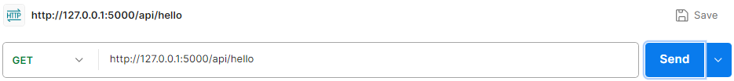
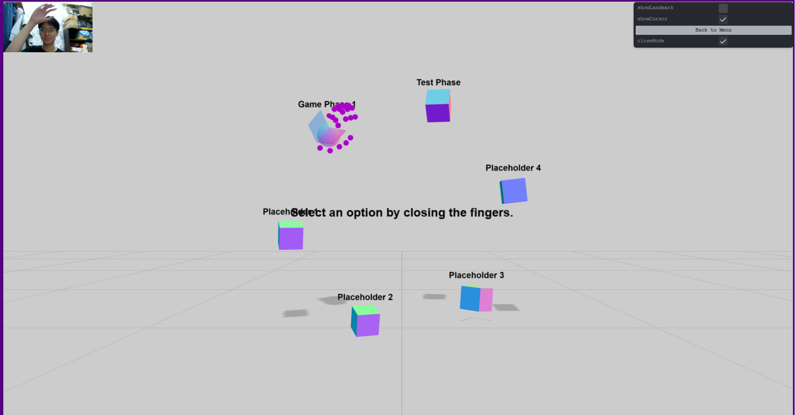
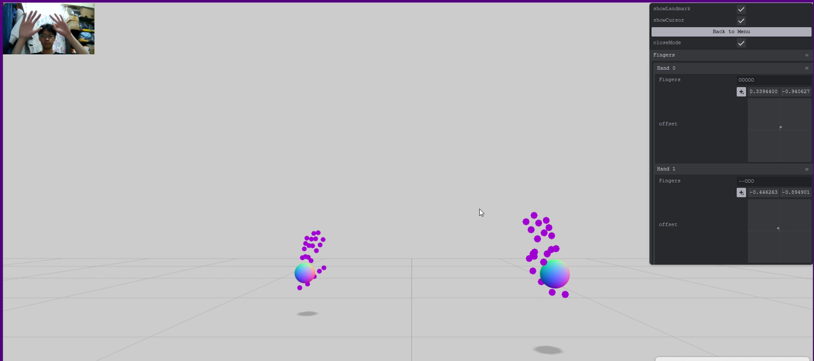

# AI Music Project

## References
* Built upon the article: https://tympanus.net/codrops/2024/10/24/creating-a-3d-hand-controller-using-a-webcam-with-mediapipe-and-three-js/

## Things to do

> [!WARNING] 
> Currently the song path CANNOT be youtube video. 
> It must be predownloaded before usage.

* Update how the boxes move.

## Recent Updates

**Support of Local Audio Added**
* Local audio is put within `backend/res/<file_name>.mp3`, which is referred in `MIR/songData.json` as `res/<file_name>.mp3`.

## Setting Up Backend

* Install ffmpeg properly and check with `ffmpeg` on cmd.
* Enter the subfolder `backend` and create a new virtual environment:
    ```bash
    python -m venv venv
    .\venv\Script\activate # windows
    source ./venv/bin/activate # linux
    ```
* Install required packages:
    ```bash
    pip install -r requirements.txt
    ```
* Set up Flask by running `app.py`:
    ```bash
    python app.py
    ```
* Testing:
    * Install Postman (you do not need to log in)
    * Refer to the URL as stated after you run `app.py`:
        ```
        Running on http://127.0.0.1:5000
        ```
    * Go to Postman and enter the relevant URL for the functionality you want to test:
        

## Changelog

* `GameController` now controls most features of the game.
* Under `js/phases/` are the different phases of the game. 
    * `SelectionMenu` is not implemented yet. It is supposed to be the selection menu for users.
    * Refer to `Phase1` for more information on how the `initialize()` and `animate()` functions are defined.
    * Remember to clear screen in the initialization.
    * `cleanUp()` function cleans the entire canvas while exiting the current one.
    * More: read the code or ask Sam.
* The `target` now tracks the center of the palm.

## 3D_control

### General GUI

* Click "Back to Menu" to exit to the menu.
* **Close Mode**:
    * "Close Mode" assumes that you are sitting right in front of the camera.
    * When the "Close Mode" is off, we assume that you are standing at least 1 meter away from the camera.
    * Adjust the `this.handControls.handOffsetZDistance` parameter in `GameController.js` for changing the perceived depth of the hand.
* Maximum number of hands is set programmatically in `MediaPipeHands.js`.

### Selection Menu

* Either punch or grab at the boxes indicating the level of your choice.
    * "punch" means holding your fist closed, and touching the boxes.
    * "grab" ("select") means you close your fist while colliding with the boxes.

    

### Test Phase

* For developer use
* Currently is testing on the detection of each finger's status (opened `O`/ closed `-`).
* You can also read the rotation of the palm.



## Backend

Processing of music info here
* Local audio is put within `backend/res/<file_name>.mp3`, which is referred in `MIR/songData.json` as `res/<file_name>.mp3`.

## MIR

Main UI here

## Innovation Ideas

* https://www.notion.so/AI-Music-Course-1393e2057e258093a9f7f0fb55184f7f?pvs=4
    * Gesture control of 3d scene

## Final Notes

* Plan to tidy up the commit history at the end or (do not tidy at all)
* Just view the vs code control graph for more info, or in github, just filter by the author of the commit.